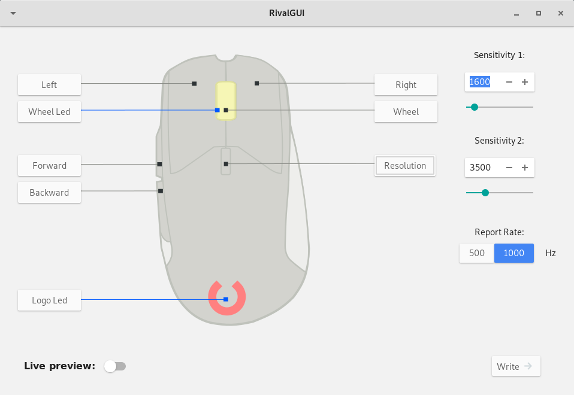

# RivalGUI

Tool to configure the Steelseries Rival 310 mouse.

##### Only the base design is done, there's no functionality yet!

### Dependencies:
  * [gtk-d](https://github.com/gtkd-developers/GtkD) (gtk, gio, rsvg, gdk and cairo)
  * [libratbag](https://github.com/libratbag/libratbag) (assets)

The project structure is based on [GtkdApp](https://gitlab.com/csoriano/GtkDApp).

#### TODO:
  * Add support for libratbag as a backend
  * Add support for configuration files
  * Revamp design

###### The TODO section doesn't include the current on-going work